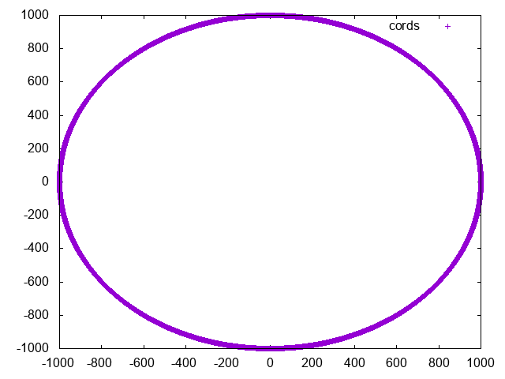

# Day 22 - Circling the solution

This task was really interesting, we have 100000 points, and have to find the shortest path between them. This turned out to be much easier than I thought. But like usual I thought the task to be much harder and went down the completely wrong path.

I tried variation of TSP, thinking that there were some correlation that would make the TSP problem not P=NP. I thin I was set on this path, as I felt the text was so obviously hinting to it. But this turned out to be a red herring. The real hint was more subtle and indicated that the points were in a circle. I only realized this after reading the task description way to many times, still not finding the clue and then being told what the clue was by a friend.

After that it was really straight forward, graph the points with gplot, see that it's an almost perfect circle. Find max and minimum X and Y respectively and use them in a way too complicated ellipse approximation function while you could've just used elementary school math's and presumed that it was a circle as the values were to be rounded down anyways.

What I've learned form this task is that I'm not really that creative and I don't look at the data I'm dealing with before trying to find the solution. Or rather I make assumption about the data, mainly that it's the most difficult dataset out there, and not that the points are scattered in the form of a circle. So the most important thing here is that if you don't immediately know how to solve a task, then at least look at the data, that'll probably give you some hints and be the difference between you solving it and dying with the CPU still chugging along, trying to solve the problem.

And ending on a positive note, I got to try gplot a plotting library for Go and I was pleasantly surprised as with most go libraries.

